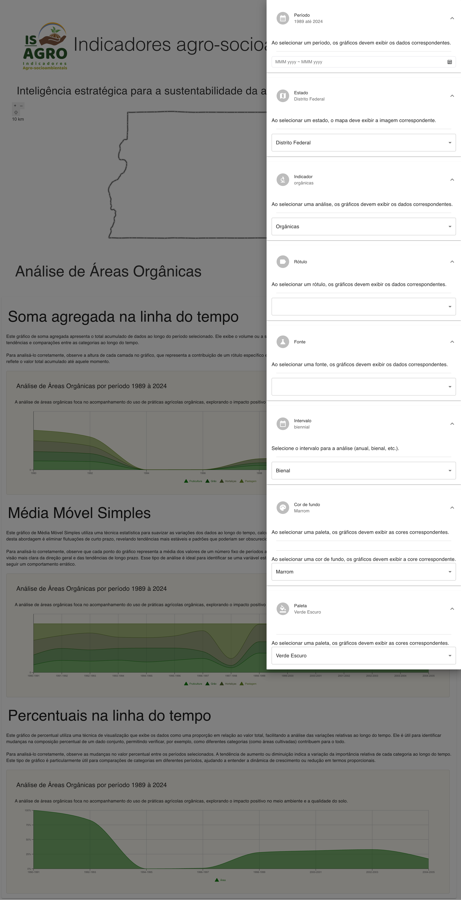

# IS-Agro Indicadores Painel Dinâmico




## Visão Geral

Este projeto é um painel dinâmico de indicadores agro-socioambientais desenvolvido para o projeto IS-Agro. O painel exibe dados interativos sobre diversas áreas como erosões, GEE, NPK, emissao-de-amonia, áreas orgânicas, pesticidas e poluições, relacionados ao território brasileiro. Os usuários podem explorar esses indicadores por diferentes estados e períodos de tempo, utilizando o mapa e os gráficos apresentados na interface.

O painel foi desenvolvido em React e inclui funcionalidades como a seleção de parâmetros (indicadores, rótulos, cores e intervalos), exibição de gráficos dinâmicos e interação com o mapa do Brasil. Este painel tem como objetivo facilitar a análise de dados agro-socioambientais por meio de uma interface intuitiva e interativa.

 - Para subir o banco de dados e a API, execute o comando abaixo:

```bash
cd .docker
docker-compose up --build
```

## Funcionalidades

- **Mapa Interativo:** Inicialmente exibe o mapa do Brasil e permite selecionar diferentes estados para filtrar os dados apresentados nos gráficos.
- **Gráficos Dinâmicos:** Exibe gráficos de soma agregada, média móvel e percentuais, atualizados com base nos parâmetros escolhidos pelo usuário.
- **Menu de Parâmetros:** Permite a escolha de diferentes indicadores, rótulos, intervalos de tempo e cores para personalizar a visualização dos dados.
- **Customização Visual:** O usuário pode ajustar as cores de fundo e escolher diferentes paletas para exibição dos gráficos e do mapa.

## Requisitos

Este projeto foi iniciado com [Create React App](https://github.com/facebook/create-react-app).

### Scripts Disponíveis

No diretório do projeto, você pode executar os seguintes comandos:

### `npm start`

Executa o aplicativo em modo de desenvolvimento.\
Abra [http://localhost:3000](http://localhost:3000) para visualizar no navegador.

### `npm run build`

Compila o aplicativo para produção na pasta `build`.\
O React será otimizado para o melhor desempenho.

## Como Contribuir

1. Faça um fork do projeto.
2. Crie um branch para a sua funcionalidade (`git checkout -b minha-funcionalidade`).
3. Faça o commit das suas mudanças (`git commit -m 'Adiciona nova funcionalidade'`).
4. Faça o push para o branch (`git push origin minha-funcionalidade`).
5. Crie um Pull Request.

## Imagens do Painel

As imagens acima foram capturadas durante a apresentação do painel com o menu de parâmetros aberto e a visualização dos gráficos interativos.

